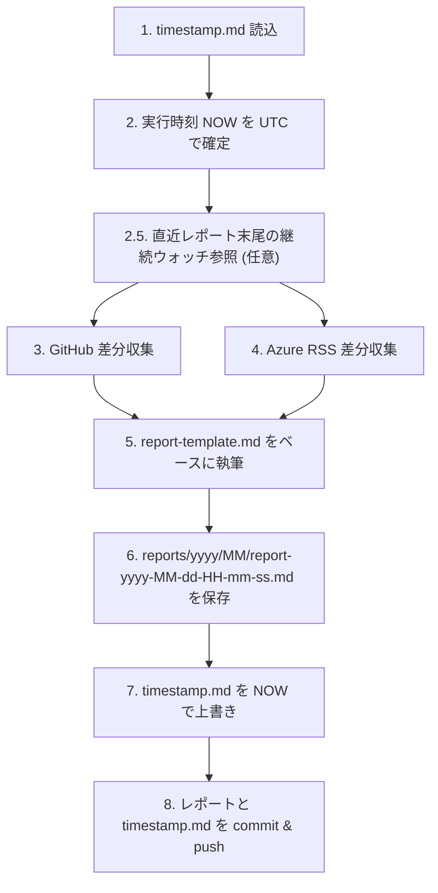

# Daily Check レポート生成 Skill

このリポジトリ (`runceel/daily-check`) の主目的である「指定 GitHub リポジトリ群 + Azure 更新の前回チェックからの差分レポートを生成する」ワークフローを自動化する Skill です。

## いつ使うか (When to use)

ユーザーが次のような依頼をしたとき、本 Skill を起動してください:

- 「差分レポートを作って」「daily check のレポートをお願い」「デイリーチェック実行して」
- 「前回からの GitHub の変化と Azure の更新まとめて」
- 「daily-check report を生成して」
- リポジトリ内で `report-yyyy-MM-dd-HH-mm-ss.md` を作るような明確な意図がある場合

## 出力物 (Deliverables)

成功時に必ず以下 3 つを実施する:

1. `reports/{yyyy}/{MM}/` 配下に `report-yyyy-MM-dd-HH-mm-ss.md` を新規作成 (`{yyyy}` / `{MM}` は `REPORT_GENERATED_AT_UTC` の UTC 年・月で 2 桁ゼロパディング)
2. リポジトリルートの `timestamp.md` を今回の実行時刻 (UTC, `yyyy-MM-dd HH:mm:ss`) で上書き (年月フォルダには移動しない、状態ファイルなのでルートに置く)
3. 上記 2 ファイルをまとめて commit し、現在のブランチに push (詳細は 5.2 節)

**レポート本文の書式 (見出し階層・表のスキーマ・各リポジトリの書き方)** は本 Skill にバンドルされた
[`references/report-template.md`](./references/report-template.md) を正本とする。本ファイルは「いつ・どうやって作るか」のみを定義する。

## 全体フロー



- すべての時刻は **UTC** で扱う (表示用に JST を併記する場合のみ変換)。
- レポート本文・要約はすべて **日本語** で記述する。

---

## 1. 入力: `timestamp.md` の読み込み

- 場所: リポジトリのルート直下 `timestamp.md`
- 形式: 1 行目に `yyyy-MM-dd HH:mm:ss` (UTC) を記述。

### 読み込みルール

1. `timestamp.md` が **存在する** 場合: 1 行目を UTC として解釈し `PREVIOUS_CHECK_AT_UTC` とする。
2. **存在しない** 場合: `NOW - 24h` を `PREVIOUS_CHECK_AT_UTC` とする。
3. `NOW` (実行時刻 UTC) を `REPORT_GENERATED_AT_UTC` としてレポート全体で使い回す。

対象期間は半開区間 `PREVIOUS_CHECK_AT_UTC < x <= REPORT_GENERATED_AT_UTC` とする。

---

## 1.5. 直近レポート末尾の継続ウォッチ参照 (推奨)

前回までのレポートに残した「継続ウォッチ中の PR / Issue」「Azure で次の段階を待っているアイテム」「次回チェックで重点的に確認したいこと」を今回の優先確認リストに引き継ぐためのステップ。**ただしレポート全文を読むのは禁止 — トークンを浪費する。末尾の `## 4. 次回チェックに向けたメモ` 以降だけを読み込む。**

### 1.5.1 対象ファイルの特定

1. `reports/` 配下に既存ファイルが **存在しない** 場合は本ステップをスキップして 2 節に進む (初回実行扱い)。
2. `reports/{yyyy}/{MM}/report-*.md` をファイル名昇順で並べたときの **最後の 1 件** を対象とする。年月フォルダが今月分まだ無い場合は、直前月 `reports/{yyyy}/{MM-1}/` の最終ファイルを対象にする。

PowerShell:

```powershell
$latest = Get-ChildItem -Path reports -Recurse -Filter "report-*.md" |
  Sort-Object Name -Descending | Select-Object -First 1
```

bash:

```bash
LATEST=$(ls -1 reports/*/*/report-*.md 2>/dev/null | sort | tail -n 1)
```

### 1.5.2 末尾セクションだけを読み込む手順 (トークン節約)

レポートは 30〜50 KB / 500 行規模になり得るため、**ファイル全体を読み込んではいけない**。以下のいずれかで `## 4. 次回チェック…` セクション以降だけを取得する:

1. **grep でアンカー行を特定 → `view_range` で末尾だけ読む** (最も精密):

   ```text
   # 1) grep で開始行を取得
   grep -n '^## 4\. 次回チェック' reports/2026/05/report-*.md
   # → file:LINE: ## 4. 次回チェックに向けたメモ / ウォッチ対象

   # 2) view ツールで view_range:[LINE, -1] を指定して末尾だけ読む
   ```

2. **grep の `-A` で直接末尾を抽出** (中間 `view` 不要):

   ```bash
   grep -n -A 200 '^## 4\. 次回チェック' "$LATEST"
   ```

   `-A 200` は安全側のマージン。出力末尾が ` ```yaml ` ブロックや EOF に到達していれば十分。

3. PowerShell の `Get-Content -Tail 80` は **アンカー行を意識しない** ので原則使わない (テンプレ更新で末尾構造が変わったときに壊れる)。

### 1.5.3 読み込んだ内容の使い方

- 「継続ウォッチ中の PR / Issue」の各番号は、今回の対象期間で **新たな進展があったか** を最優先で確認する (マージされた / クローズされた / 関連 PR が出た等)。
- 「Azure で次の段階を待っているアイテム」は、今回の Azure RSS 取得結果で **次ステージ (Preview→GA、Launched、Retired) に進んだか** を照合する。
- 「次回チェックで重点的に確認したいこと」は、今回のレポートでも触れるかどうかの判断材料にする。

### 1.5.4 引き継ぎとレポート本文

- 進展があった項目は今回のレポート本文 (該当リポジトリの「主要な変更点」または agent-framework の詳細セクション) で言及する。
- 進展が無くまだ追跡継続するものは、今回のレポートの「## 4. 次回チェックに向けたメモ」にも再度書く (引き継ぎが切れないように)。
- 既に解決済み / クローズ済みで追跡不要になった項目は再掲しない。

> ⚠ **絶対ルール**: 直近レポートの本文 (詳細 PR セクションやテーブル) は読み込まない。`## 4. 次回チェック…` 以降だけで十分であり、本文を読むとコンテキスト消費がレポート 1 本ぶん丸ごと増える。

---

## 2. データ収集: GitHub リポジトリ

### 2.1 対象リポジトリと収集モード

| owner/repo                              | 収集モード | テンプレートのセクション |
| --------------------------------------- | ---------- | ------------------------ |
| `microsoft/agent-framework`             | **詳細**   | 3.1 |
| `dotnet/aspnetcore`                     | サマリー   | 3.2 |
| `Azure/azure-functions-dotnet-worker`   | サマリー   | 3.3 |
| `dotnet/extensions`                     | サマリー   | 3.4 |
| `runceel/ReactiveProperty`              | サマリー   | 3.5 |
| `microsoft/aspire`                         | サマリー   | 3.6 |

### 2.2 取得対象データ

期間内に **更新があった** ものをすべて拾う (`updated` / `merged` / `closed` / `created` のいずれかが期間内)。

- **PR**: マージ済み / 新規オープン (open のまま) / 未マージでクローズ
- **Issue**: 新規オープン / クローズ

### 2.3 推奨コマンド (`gh` CLI)

`{PREV}` は `yyyy-MM-ddTHH:mm:ssZ` 形式 (ISO 8601, UTC)。

```bash
# マージ済み PR
gh search prs --repo {OWNER}/{REPO} --merged-at ">={PREV}" \
  --json number,title,author,mergedAt,url,labels,body --limit 100

# 新規 Issue
gh search issues --repo {OWNER}/{REPO} --created ">={PREV}" \
  --json number,title,author,createdAt,state,url,labels,body --limit 100

# クローズ Issue
gh search issues --repo {OWNER}/{REPO} --closed ">={PREV}" \
  --json number,title,closedAt,state,url --limit 100
```

REST/GraphQL を直接叩く場合は `gh api` または GraphQL の `updatedAt` でフィルタする。

### 2.4 詳細モード (microsoft/agent-framework)

サマリー収集に加えて、PR 1 件ごとに以下を取得:

```bash
gh pr view {NUM} --repo microsoft/agent-framework --json files,additions,deletions,commits
gh api repos/microsoft/agent-framework/pulls/{NUM}/files --paginate
```

執筆時に重視するポイント:

- **公開 API の変化** (型・メソッド・拡張メソッドの追加 / 削除 / シグネチャ変更)
- **破壊的変更** — レポート本文に `⚠ 破壊的変更` と明示
- **設定キー / DI 登録 API の変化**
- **新規追加された抽象 / インターフェイス**
- **既定値・依存パッケージのバージョン変更**

可能ならビフォー/アフターを ` ```csharp ` ブロックで示す。Issue については、本文 + 直近 3〜5 件のコメント + 参照されている PR を取得し、「背景」「議論ポイント」「現在の方針」を要約する。

### 2.5 ボリュームが多い場合の優先度

期間内の変更が多いリポジトリでは、本文で個別解説するのは **上位 5〜10 件** に絞り、残りは「その他の変更」テーブルへ機械的に列挙する。優先順位:

1. ⚠ 破壊的変更を含むもの
2. セキュリティ修正
3. リリースタグ / GA / メジャー機能追加
4. 多くのファイル / コミットを含むリファクタ・新機能
5. 公式ロードマップ / マイルストーンに紐付くもの

---

## 3. データ収集: Azure 更新 RSS

- ソース: <https://www.microsoft.com/releasecommunications/api/v2/azure/rss>
- 取得形式: RSS 2.0 (XML)
- フィルタ: `<pubDate>` を UTC として解釈し、対象期間内 (`PREV < pubDate <= NOW`) の項目のみ採用。

### 3.1 取得コマンド例

```bash
curl -sSL "https://www.microsoft.com/releasecommunications/api/v2/azure/rss" -o azure-rss.xml
```

PowerShell:

```powershell
Invoke-RestMethod "https://www.microsoft.com/releasecommunications/api/v2/azure/rss" -OutFile azure-rss.xml
```

### 3.2 カテゴリ判定

各 `<item>` から `title` / `link` / `pubDate` / `category` / `description` を抽出。
テンプレートのサブセクション (`### 2.1 In development` 等) への振り分けは `category` を優先し、無ければ `title` 内のキーワード (`"In development"`, `"Public Preview"`, `"Generally Available"`, `"Launched"`, `"Retiring"`) で判定する。どれにも当てはまらない場合は `### 2.6 その他` に入れる。

### 3.3 概要解説の書き方

単なる原文の直訳は避け、各項目に **日本語の概要 2〜4 行** を書く:

1. **何が変わるのか** — 機能・スコープ・対象リージョン
2. **誰に影響するか** — どんな利用シナリオに効くか
3. **どう使い始める / 移行するか** — Preview なら有効化方法、Retirement なら移行先と期限

該当カテゴリに項目が無い場合は、そのサブセクションごと **削除** してよい (空のままにしない)。

---

## 4. 出力: レポートファイル

### 4.1 出力パス

```
reports/{yyyy}/{MM}/report-yyyy-MM-dd-HH-mm-ss.md
```

- `{yyyy}` / `{MM}` および日時部分はすべて `REPORT_GENERATED_AT_UTC` (UTC) をフォーマットしたもの。
- `{yyyy}` は 4 桁年、`{MM}` は **2 桁ゼロパディング** の月 (例: `05`)。
- 日時の区切り文字はハイフン `-` のみ (コロン・空白は使わない)。
- 例: `reports/2026/05/report-2026-05-23-14-08-03.md`

ルートに大量の `report-*.md` が溜まらないよう、必ず年月フォルダ配下に作成する。`timestamp.md` は運用状態ファイルとしてリポジトリルートに置いたままにする (年月フォルダには移動しない)。

ファイル書き込み前に `reports/{yyyy}/{MM}/` フォルダが無ければ自動作成する:

PowerShell:

```powershell
$year = (Get-Date).ToUniversalTime().ToString("yyyy")
$month = (Get-Date).ToUniversalTime().ToString("MM")
$reportDir = Join-Path "reports" (Join-Path $year $month)
New-Item -ItemType Directory -Force -Path $reportDir | Out-Null
```

bash:

```bash
YEAR=$(date -u +'%Y')
MONTH=$(date -u +'%m')
REPORT_DIR="reports/$YEAR/$MONTH"
mkdir -p "$REPORT_DIR"
```

### 4.2 執筆手順

1. 本 Skill の `references/report-template.md` を読み込み、構造をコピーして `reports/{yyyy}/{MM}/` 配下に上記ファイル名で新規作成する (フォルダが無ければ 4.1 の手順で作成してから書き込む)。
   - テンプレート本体は移動・改変しない (次回以降の生成でも同じ書式を使う)。
2. `{{...}}` プレースホルダをすべて埋める。該当項目が無いセクションはサブセクションごと削除する。
3. 本文中の `<!-- HINT: ... -->` コメントは執筆の指針として参照し、最終出力では **削除する** (運用方針: 残さない)。
4. レポート末尾の YAML メタデータブロックも実値で埋める。

### 4.3 文章スタイル

- すべて日本語。固有名詞 (API 名、製品名、リポジトリ名) は原語のまま。
- 箇条書きと表を活用し、長い段落は避ける。
- 数値は半角、句読点は `、` `。` を使う。
- 「破壊的変更」「セキュリティ修正」「GA 昇格」など重要なキーワードは太字で強調する。

---

## 5. 完了処理: `timestamp.md` の更新と commit/push

レポートの保存が完了したら、`timestamp.md` を **今回の `REPORT_GENERATED_AT_UTC`** で上書きしたうえで、生成した `reports/{yyyy}/{MM}/report-yyyy-MM-dd-HH-mm-ss.md` と更新後の `timestamp.md` を一括で commit & push する。

> ⚠ **失敗時のルール**: レポート生成が途中で失敗した場合 (GitHub / RSS 取得エラー、テンプレート埋め込み失敗、レポートファイル保存失敗など) は、`timestamp.md` を **更新しない** だけでなく、**commit も push も行わない**。次回実行で同じ期間を再度拾えるようにするため、作業途中の中間ファイルが残っていれば `git restore` / `git clean` で破棄してから終了する。

### 5.1 `timestamp.md` の更新

書式は `yyyy-MM-dd HH:mm:ss` (UTC)。

PowerShell:

```powershell
$now = (Get-Date).ToUniversalTime().ToString("yyyy-MM-dd HH:mm:ss")
Set-Content -Path timestamp.md -Value $now -NoNewline
```

bash:

```bash
date -u +"%Y-%m-%d %H:%M:%S" > timestamp.md
```

### 5.2 commit と push

`timestamp.md` の更新が成功した直後に、生成済みのレポートファイルと `timestamp.md` をまとめて commit し、現在のブランチへ push する。

コミットメッセージは以下のフォーマットを使う (時刻は `REPORT_GENERATED_AT_UTC` を `yyyy-MM-dd HH:mm:ss UTC` で表記):

```
Daily check report: yyyy-MM-dd HH:mm:ss UTC
```

例:

```
Daily check report: 2026-05-23 04:57:34 UTC
```

PowerShell:

```powershell
$nowUtc = (Get-Date).ToUniversalTime()
$year = $nowUtc.ToString("yyyy")
$month = $nowUtc.ToString("MM")
$reportFile = "reports/$year/$month/report-$($nowUtc.ToString('yyyy-MM-dd-HH-mm-ss')).md"
$commitMessage = "Daily check report: $($nowUtc.ToString('yyyy-MM-dd HH:mm:ss')) UTC"
git add $reportFile timestamp.md
git commit -m $commitMessage
git push
```

bash:

```bash
YEAR=$(date -u +'%Y')
MONTH=$(date -u +'%m')
REPORT_FILE="reports/$YEAR/$MONTH/report-$(date -u +'%Y-%m-%d-%H-%M-%S').md"
COMMIT_MESSAGE="Daily check report: $(date -u +'%Y-%m-%d %H:%M:%S') UTC"
git add "$REPORT_FILE" timestamp.md
git commit -m "$COMMIT_MESSAGE"
git push
```

注意:

- 上の例では実行のたびに `date` / `Get-Date` を呼んでいるが、実際には Skill の冒頭で確定した `REPORT_GENERATED_AT_UTC` を使い回し、年月フォルダのパス・ファイル名・`timestamp.md` の中身・コミットメッセージで **同一の時刻** になるようにする。
- `git add` 対象は **今回生成した `reports/{yyyy}/{MM}/report-*.md` と `timestamp.md` の 2 ファイルだけ** に限定する (`git add .` や `git add reports/` などで他の変更を巻き込まない)。
- push 先のブランチは現在チェックアウトされているブランチをそのまま使う (Skill 側で勝手にブランチを切り替えない)。
- push が失敗した場合 (権限不足・リモート未設定など) は、ユーザーに状況を報告して手動対応を促す。`timestamp.md` を巻き戻す必要はない (ローカルの commit は残しておく)。

---

## 6. 完了前チェックリスト

- [ ] `PREVIOUS_CHECK_AT_UTC` と `REPORT_GENERATED_AT_UTC` がレポート冒頭に正しく入っている
- [ ] 直近レポートが存在する場合、その末尾 (`## 4. 次回チェック…` 以降のみ) を `grep` + `view_range` で読み、継続ウォッチ項目を今回確認した (本文は読まないこと)
- [ ] Azure 更新セクションがレポートの **先頭グループ** (セクション 2) にある
- [ ] `microsoft/agent-framework` セクションに **コミットレベルの詳細** が書かれている (変更ファイル一覧 / API 変化 / 破壊的変更の明示)
- [ ] その他 5 リポジトリは **サマリー + リンク表** で完結している
- [ ] エグゼクティブサマリーが 3〜5 件にまとまっている
- [ ] 「次回チェックに向けたメモ」が埋まっている
- [ ] 残ったプレースホルダ (`{{...}}`) が無い
- [ ] レポートが `reports/{yyyy}/{MM}/report-yyyy-MM-dd-HH-mm-ss.md` (UTC 年・月、ゼロパディング 2 桁) に保存され、必要なら年月フォルダが新規作成されている
- [ ] `timestamp.md` を `REPORT_GENERATED_AT_UTC` で上書きした (ルート直下のまま、移動していない)
- [ ] レポート (`reports/{yyyy}/{MM}/report-*.md`) と `timestamp.md` を commit して push した (コミットメッセージ: `Daily check report: yyyy-MM-dd HH:mm:ss UTC`)

---

## 関連ファイル

- `./references/report-template.md` — レポート本文の書式テンプレート (正本)。Skill 実行時に **読み込み専用** で参照する。
- リポジトリルートの `timestamp.md` — 前回チェック時刻の保存先 (実行時に作成・更新、ルートのまま移動しない)
- `reports/{yyyy}/{MM}/report-yyyy-MM-dd-HH-mm-ss.md` — Skill 実行の出力物 (年月フォルダは必要に応じて自動作成)。**直近 1 件は次回実行時に末尾セクションのみ読み込み参照する** (1.5 節)。
