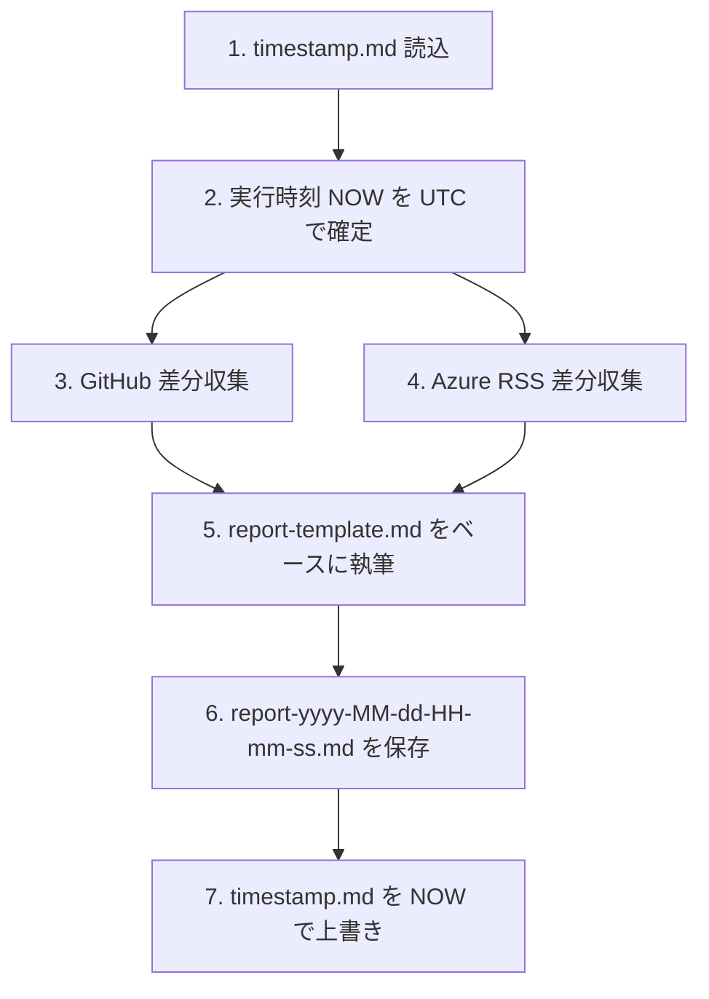

# Daily Check レポート生成 Skill

このリポジトリ (`runceel/daily-check`) の主目的である「指定 GitHub リポジトリ群 + Azure 更新の前回チェックからの差分レポートを生成する」ワークフローを自動化する Skill です。

## いつ使うか (When to use)

ユーザーが次のような依頼をしたとき、本 Skill を起動してください:

- 「差分レポートを作って」「daily check のレポートをお願い」「デイリーチェック実行して」
- 「前回からの GitHub の変化と Azure の更新まとめて」
- 「daily-check report を生成して」
- リポジトリ内で `report-yyyy-MM-dd-HH-mm-ss.md` を作るような明確な意図がある場合

## 出力物 (Deliverables)

成功時に必ず以下 2 つを実施する:

1. リポジトリルートに `report-yyyy-MM-dd-HH-mm-ss.md` を新規作成
2. リポジトリルートの `timestamp.md` を今回の実行時刻 (UTC, `yyyy-MM-dd HH:mm:ss`) で上書き

**レポート本文の書式 (見出し階層・表のスキーマ・各リポジトリの書き方)** は本 Skill にバンドルされた
[`references/report-template.md`](./references/report-template.md) を正本とする。本ファイルは「いつ・どうやって作るか」のみを定義する。

## 全体フロー



- すべての時刻は **UTC** で扱う (表示用に JST を併記する場合のみ変換)。
- レポート本文・要約はすべて **日本語** で記述する。

---

## 1. 入力: `timestamp.md` の読み込み

- 場所: リポジトリのルート直下 `timestamp.md`
- 形式: 1 行目に `yyyy-MM-dd HH:mm:ss` (UTC) を記述。

### 読み込みルール

1. `timestamp.md` が **存在する** 場合: 1 行目を UTC として解釈し `PREVIOUS_CHECK_AT_UTC` とする。
2. **存在しない** 場合: `NOW - 24h` を `PREVIOUS_CHECK_AT_UTC` とする。
3. `NOW` (実行時刻 UTC) を `REPORT_GENERATED_AT_UTC` としてレポート全体で使い回す。

対象期間は半開区間 `PREVIOUS_CHECK_AT_UTC < x <= REPORT_GENERATED_AT_UTC` とする。

---

## 2. データ収集: GitHub リポジトリ

### 2.1 対象リポジトリと収集モード

| owner/repo                              | 収集モード | テンプレートのセクション |
| --------------------------------------- | ---------- | ------------------------ |
| `microsoft/agent-framework`             | **詳細**   | 3.1 |
| `dotnet/aspnetcore`                     | サマリー   | 3.2 |
| `Azure/azure-functions-dotnet-worker`   | サマリー   | 3.3 |
| `dotnet/extensions`                     | サマリー   | 3.4 |
| `runceel/ReactiveProperty`              | サマリー   | 3.5 |
| `dotnet/aspire`                         | サマリー   | 3.6 |

### 2.2 取得対象データ

期間内に **更新があった** ものをすべて拾う (`updated` / `merged` / `closed` / `created` のいずれかが期間内)。

- **PR**: マージ済み / 新規オープン (open のまま) / 未マージでクローズ
- **Issue**: 新規オープン / クローズ

### 2.3 推奨コマンド (`gh` CLI)

`{PREV}` は `yyyy-MM-ddTHH:mm:ssZ` 形式 (ISO 8601, UTC)。

```bash
# マージ済み PR
gh search prs --repo {OWNER}/{REPO} --merged-at ">={PREV}" \
  --json number,title,author,mergedAt,url,labels,body --limit 100

# 新規 Issue
gh search issues --repo {OWNER}/{REPO} --created ">={PREV}" \
  --json number,title,author,createdAt,state,url,labels,body --limit 100

# クローズ Issue
gh search issues --repo {OWNER}/{REPO} --closed ">={PREV}" \
  --json number,title,closedAt,state,url --limit 100
```

REST/GraphQL を直接叩く場合は `gh api` または GraphQL の `updatedAt` でフィルタする。

### 2.4 詳細モード (microsoft/agent-framework)

サマリー収集に加えて、PR 1 件ごとに以下を取得:

```bash
gh pr view {NUM} --repo microsoft/agent-framework --json files,additions,deletions,commits
gh api repos/microsoft/agent-framework/pulls/{NUM}/files --paginate
```

執筆時に重視するポイント:

- **公開 API の変化** (型・メソッド・拡張メソッドの追加 / 削除 / シグネチャ変更)
- **破壊的変更** — レポート本文に `⚠ 破壊的変更` と明示
- **設定キー / DI 登録 API の変化**
- **新規追加された抽象 / インターフェイス**
- **既定値・依存パッケージのバージョン変更**

可能ならビフォー/アフターを ` ```csharp ` ブロックで示す。Issue については、本文 + 直近 3〜5 件のコメント + 参照されている PR を取得し、「背景」「議論ポイント」「現在の方針」を要約する。

### 2.5 ボリュームが多い場合の優先度

期間内の変更が多いリポジトリでは、本文で個別解説するのは **上位 5〜10 件** に絞り、残りは「その他の変更」テーブルへ機械的に列挙する。優先順位:

1. ⚠ 破壊的変更を含むもの
2. セキュリティ修正
3. リリースタグ / GA / メジャー機能追加
4. 多くのファイル / コミットを含むリファクタ・新機能
5. 公式ロードマップ / マイルストーンに紐付くもの

---

## 3. データ収集: Azure 更新 RSS

- ソース: <https://www.microsoft.com/releasecommunications/api/v2/azure/rss>
- 取得形式: RSS 2.0 (XML)
- フィルタ: `<pubDate>` を UTC として解釈し、対象期間内 (`PREV < pubDate <= NOW`) の項目のみ採用。

### 3.1 取得コマンド例

```bash
curl -sSL "https://www.microsoft.com/releasecommunications/api/v2/azure/rss" -o azure-rss.xml
```

PowerShell:

```powershell
Invoke-RestMethod "https://www.microsoft.com/releasecommunications/api/v2/azure/rss" -OutFile azure-rss.xml
```

### 3.2 カテゴリ判定

各 `<item>` から `title` / `link` / `pubDate` / `category` / `description` を抽出。
テンプレートのサブセクション (`### 2.1 In development` 等) への振り分けは `category` を優先し、無ければ `title` 内のキーワード (`"In development"`, `"Public Preview"`, `"Generally Available"`, `"Launched"`, `"Retiring"`) で判定する。どれにも当てはまらない場合は `### 2.6 その他` に入れる。

### 3.3 概要解説の書き方

単なる原文の直訳は避け、各項目に **日本語の概要 2〜4 行** を書く:

1. **何が変わるのか** — 機能・スコープ・対象リージョン
2. **誰に影響するか** — どんな利用シナリオに効くか
3. **どう使い始める / 移行するか** — Preview なら有効化方法、Retirement なら移行先と期限

該当カテゴリに項目が無い場合は、そのサブセクションごと **削除** してよい (空のままにしない)。

---

## 4. 出力: レポートファイル

### 4.1 ファイル名

```
report-yyyy-MM-dd-HH-mm-ss.md
```

- 日時は `REPORT_GENERATED_AT_UTC` をフォーマット。
- 区切り文字はハイフン `-` のみ (コロン・空白は使わない)。

### 4.2 執筆手順

1. 本 Skill の `references/report-template.md` を読み込み、構造をコピーしてリポジトリルートに上記ファイル名で新規作成する。
   - テンプレート本体は移動・改変しない (次回以降の生成でも同じ書式を使う)。
2. `{{...}}` プレースホルダをすべて埋める。該当項目が無いセクションはサブセクションごと削除する。
3. 本文中の `<!-- HINT: ... -->` コメントは執筆の指針として参照し、最終出力では **削除する** (運用方針: 残さない)。
4. レポート末尾の YAML メタデータブロックも実値で埋める。

### 4.3 文章スタイル

- すべて日本語。固有名詞 (API 名、製品名、リポジトリ名) は原語のまま。
- 箇条書きと表を活用し、長い段落は避ける。
- 数値は半角、句読点は `、` `。` を使う。
- 「破壊的変更」「セキュリティ修正」「GA 昇格」など重要なキーワードは太字で強調する。

---

## 5. 完了処理: `timestamp.md` の更新

レポート保存後、`timestamp.md` を **今回の `REPORT_GENERATED_AT_UTC`** で上書きする。書式は `yyyy-MM-dd HH:mm:ss` (UTC)。

PowerShell:

```powershell
$now = (Get-Date).ToUniversalTime().ToString("yyyy-MM-dd HH:mm:ss")
Set-Content -Path timestamp.md -Value $now -NoNewline
```

bash:

```bash
date -u +"%Y-%m-%d %H:%M:%S" > timestamp.md
```

> ⚠ レポート生成が途中で失敗した場合は `timestamp.md` を **更新しない**。次回実行で同じ期間を再度拾えるようにするため。

---

## 6. 完了前チェックリスト

- [ ] `PREVIOUS_CHECK_AT_UTC` と `REPORT_GENERATED_AT_UTC` がレポート冒頭に正しく入っている
- [ ] Azure 更新セクションがレポートの **先頭グループ** (セクション 2) にある
- [ ] `microsoft/agent-framework` セクションに **コミットレベルの詳細** が書かれている (変更ファイル一覧 / API 変化 / 破壊的変更の明示)
- [ ] その他 5 リポジトリは **サマリー + リンク表** で完結している
- [ ] エグゼクティブサマリーが 3〜5 件にまとまっている
- [ ] 「次回チェックに向けたメモ」が埋まっている
- [ ] 残ったプレースホルダ (`{{...}}`) が無い
- [ ] `timestamp.md` を `REPORT_GENERATED_AT_UTC` で上書きした

---

## 関連ファイル

- `./references/report-template.md` — レポート本文の書式テンプレート (正本)。Skill 実行時に **読み込み専用** で参照する。
- リポジトリルートの `timestamp.md` — 前回チェック時刻の保存先 (実行時に作成・更新)
- リポジトリルートに生成される `report-yyyy-MM-dd-HH-mm-ss.md` — Skill 実行の出力物
